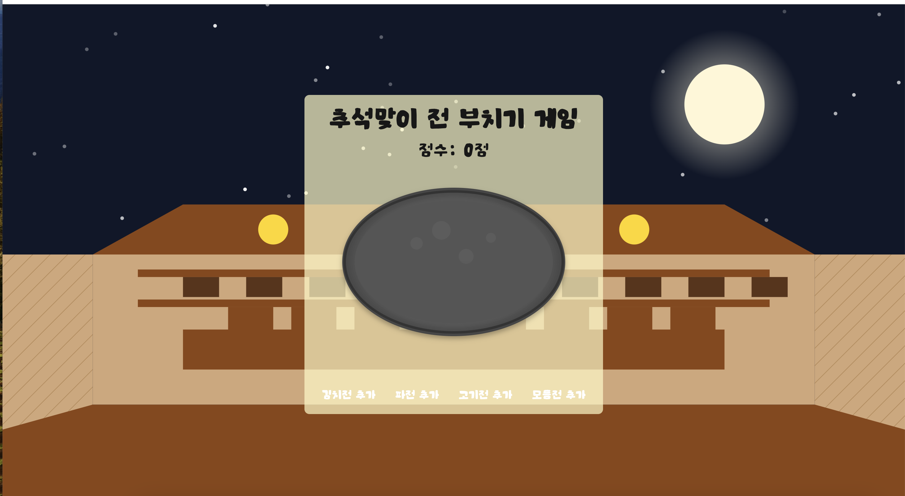

# 추석맞이 전 부치기 게임



## 프로젝트 개요
이 프로젝트는 한국의 전통 음식인 '전'을 주제로 한 간단한 웹 기반 게임입니다. 사용자는 다양한 종류의 전을 팬에 올려 적절한 타이밍에 뒤집어 점수를 얻는 방식으로 게임을 진행합니다. 한국의 전통적인 주막 배경을 활용하여 시각적 즐거움을 더했습니다.

## 주요 기능
- 다양한 종류의 전(김치전, 파전, 고기전, 모듬전) 추가
- 전을 적절한 타이밍에 뒤집어 점수 획득
- 전이 타는 것을 방지하기 위한 시간 제한
- 반응형 디자인으로 다양한 디바이스 지원
- 한국 전통 주막 테마의 배경

## 사용된 기술 스택
- React (Next.js)
- TypeScript
- Tailwind CSS
- SVG (배경 및 UI 요소)

## 컴포넌트 구조
1. `PancakeGame`: 메인 게임 컴포넌트
2. `Jeon`: 개별 전을 표현하는 컴포넌트
3. `Pan`: 전을 굽는 팬을 표현하는 컴포넌트
4. `JumakBackground`: 주막 배경을 그리는 SVG 컴포넌트

## 게임 로직
1. 사용자가 전 추가 버튼을 클릭하여 팬에 전을 추가
2. 각 전은 일정 시간 후 타기 시작함
3. 사용자는 전을 클릭하여 뒤집을 수 있음
4. 적절한 타이밍에 뒤집으면 점수 획득, 타면 점수 감소
5. 뒤집힌 전을 다시 클릭하여 제거하고 추가 점수 획득
6. 100점 달성 시 게임 종료


## 설치 및 실행 방법
1. 저장소 클론:
   ```
   git clone [저장소 URL]
   ```
2. 의존성 설치:
   ```
   npm install
   ```
3. 개발 서버 실행:
   ```
   npm run dev
   ```
4. 브라우저에서 `http://localhost:3000` 접속

## 추가 개선 사항
- 난이도 조절 기능 추가
- 사운드 효과 및 배경 음악 추가
- 게임 결과 저장 및 랭킹 시스템 구현
- 다국어 지원 추가
- 애니메이션 효과 개선

## 기여 방법
이슈 등록이나 풀 리퀘스트를 통해 프로젝트에 기여할 수 있습니다. 모든 기여는 환영합니다!

## 라이선스
이 프로젝트는 [라이선스 이름] 하에 배포됩니다. 자세한 내용은 LICENSE 파일을 참조하세요.
